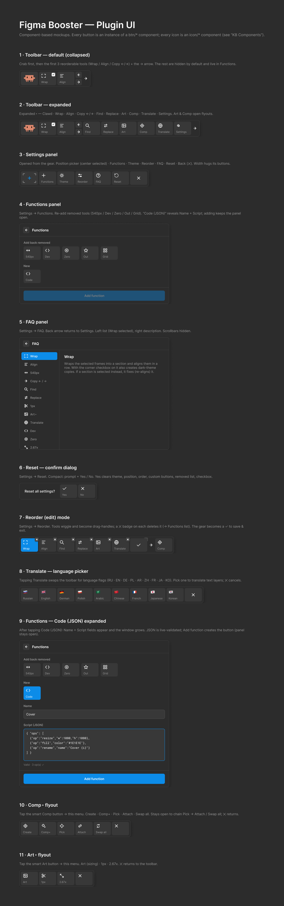

# Figma Booster

A compact, horizontal collapsible toolbar for Figma that speeds up UI‑kit
workflows — section wrapping with dark‑theme copies, component tooling,
art‑task sizing, a translator, dev status, and custom JSON buttons — plus an
animated **Clawd** crab pet.



The toolbar stays out of your way until needed. Buttons can be reordered,
hidden, or added from **Settings → Functions**.

## Default toolbar

After a reset the row is:

🦀 **Clawd** · **Wrap** · **Align** · **Copy ← / →** · **Find** · **Replace** ·
**Art ▸** · **Comp ▸** · **Translate**

Collapsed it shows the first few tools + the expand arrow. Everything else
(540px, Dev, Zero, Out, Grid) starts hidden and can be re‑added in Functions.

## Tools

### Wrap / Fix

Contextual smart button:

- **Frames selected** → wraps them into a section, aligns horizontally (80px
  gaps); if a "Dark" variable mode exists, also creates dark‑theme copies below.
- **Section selected** → rebuilds the dark copies and re‑aligns / resizes it.
- The corner checkbox toggles dark‑theme creation on/off.

### Align

Lays the page's sections (or the selected ones) into a row with 400px gaps,
starting from the leftmost selection or from (0, 0).

### Copy ← / →

Duplicates the selected frame left or right. Inside a section it shifts the
neighbours and the section; a standalone frame is simply copied to the side.

### Find

Selects every object on the page with the same name and size as the selected one.

### Replace

Replaces all selected objects with a copy of the reference (the last‑selected
object), keeping each target's position and size.

### Art ▸ (smart button)

Opens a flyout of art / export actions:

- **Art** — fills the selected ArtTask with the target's size (and ×3) and draws
  a green arrow to it
- **1px** — wraps objects in a 1px‑border frame for clean slicing / export
- **2.67x** — rescales ×2.67, rounds to even px, stacks into a "Slice" section

### Comp ▸ (smart button) — component tooling

Opens a flyout of component actions (reimplemented from the *documented
behaviour* of the "Master" plugin — no proprietary code):

- **Create** — wrap each selected object into its own master component
- **Comp+** — one new master component + an instance for every selected object,
  overrides preserved
- **Pick** — remember a target component
- **Attach** — turn the selected objects into instances of the picked target
- **Swap all** — replace every instance of a component with the picked target,
  file‑wide

The menu stays open so you can chain **Pick → Attach / Swap all**.

### Audit ▸ (smart button)

Checks the selection for autotest readiness against an internal checklist and
comments its findings straight onto the canvas. Three actions in the flyout plus
a standalone **Radius** button:

- **Find** — run the check. Selects every layer it flags, reports the counts in
  one toast, and posts one comment per rule per screen. Changes no layer, but
  with a Figma token saved in Settings the comments it posts are visible to
  everyone with the file
- **Fix** — bind hand-set values to the library token that already carries
  exactly that value, and rename frames still called `Frame 12` after what is
  inside them. Nothing is moved or deleted; one Cmd+Z reverts the run
- **Clean** — delete the comments this plugin posted, recognised by a marker in
  their text. Comments written by people are never touched, and a Booster
  comment someone has replied to is kept. The first press only counts them
- **Radius** — make a nested corner radius concentric with its parent. This one
  does change the number on the layer, which is why it is not folded into Fix.
  Hidden by default; add it from **Settings → Functions**

Spelling is checked against Russian and English dictionaries embedded in the
plugin — nothing is uploaded and no network call is made.

**The rules, the thresholds and the reasoning behind every decision are in
[`docs/AUDIT.md`](docs/AUDIT.md).** Read that before changing the audit.

### Translate

Swaps the toolbar for language flags — pick one to translate all text layers in
the selection via Google Translate (Russian, English, German, Polish, Arabic,
Chinese, French, Japanese, Korean).

### Dev / Zero

**Dev** toggles "Ready for Dev" on selected sections / frames (or all sections).
**Zero** moves the single selected object to (0, 0).

### Hidden by default (add via Functions)

- **540px** — wrap the object in a 540px auto‑layout frame (16px side padding)
- **Out** — pull the selected layers out of auto‑layout (absolute) and raise them
- **Grid** — arrange the selection (or a section's children) into a size‑grouped grid

### Custom "Code" buttons

Create your own toolbar buttons from a JSON recipe (`{ "ops": [ … ] }`) — `move`,
`pos`, `resize`, `fill`, `stroke`, `rename`, `text`, and more. Runs on a safe
whitelist in the plugin sandbox (no `eval`).

## Clawd pet 🦀

An animated pixel‑art crab that idles, reacts to tool clicks, and plays when you
tap it. Animations are adapted from the **clawd‑tank** project (MIT) — see
[`THIRD_PARTY_NOTICES.md`](THIRD_PARTY_NOTICES.md). Not affiliated with Anthropic.

## UI

- **Collapsible toolbar** with dynamic width.
- **Settings:** Position (5 zones) · Theme (light / dark) · Reorder · Functions ·
  FAQ · Reset.
- **Functions panel:** re‑add hidden tools or create Code (JSON) buttons; it
  stays open after adding so you can add several in a row.
- **Reorder mode:** drag to reorder; a ✕ badge on each button removes it (removed
  built‑ins move to the Functions add‑list).
- All preferences (position, theme, order, custom buttons, hidden list) persist
  in `clientStorage`.

## Installation

1. Clone or download this repository.
2. In Figma: **Plugins → Development → Import plugin from manifest** → select
   `manifest.json`.

The build is committed, so the plugin runs immediately.

## Development

```bash
npm install
npm run build    # tsc → dist/src/code.js
npm run watch    # rebuild on changes
```

`src/code.ts` is the plugin sandbox (compiled); `ui.html` is the UI iframe (not
compiled). See [`docs/CLAUDE.md`](docs/CLAUDE.md) for architecture details and
[`docs/AUDIT.md`](docs/AUDIT.md) for the audit.

`ui.html` carries the embedded spelling dictionaries (~1.2 MB because of them).
Rebuild them with `npm run build:dict` after updating the dictionary packages.

## Requirements

- Figma desktop
- For dark‑theme copies: a variable collection with a "Dark" mode (local or library)
- For art tasks: an ArtTask component in the file
